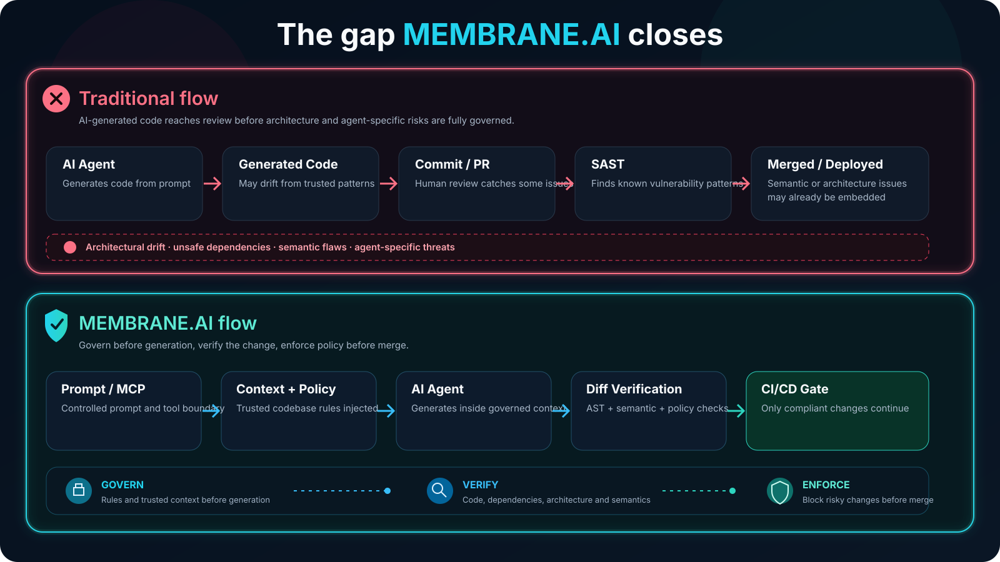
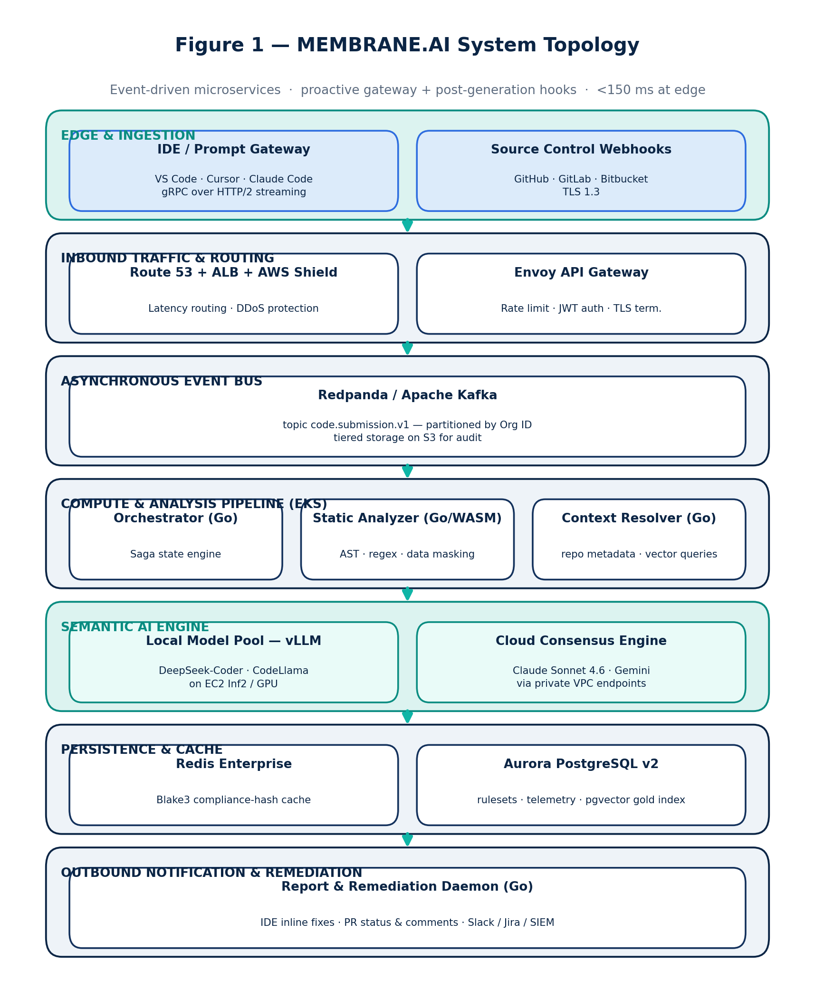
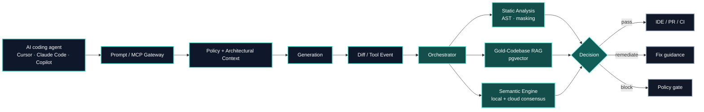
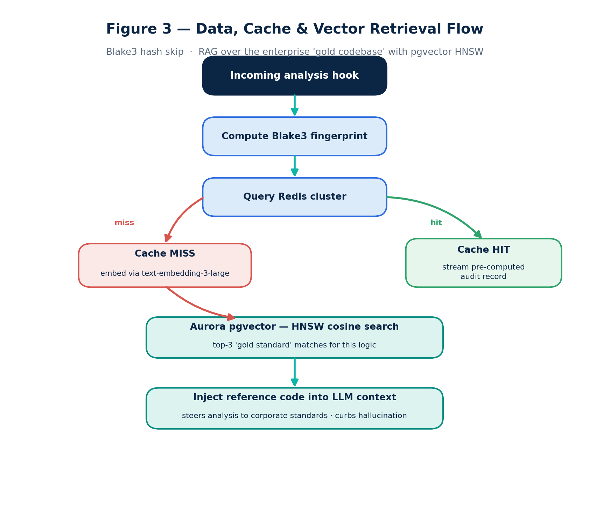
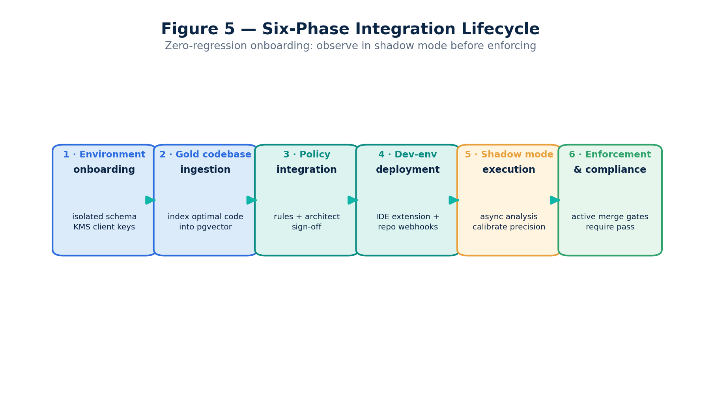
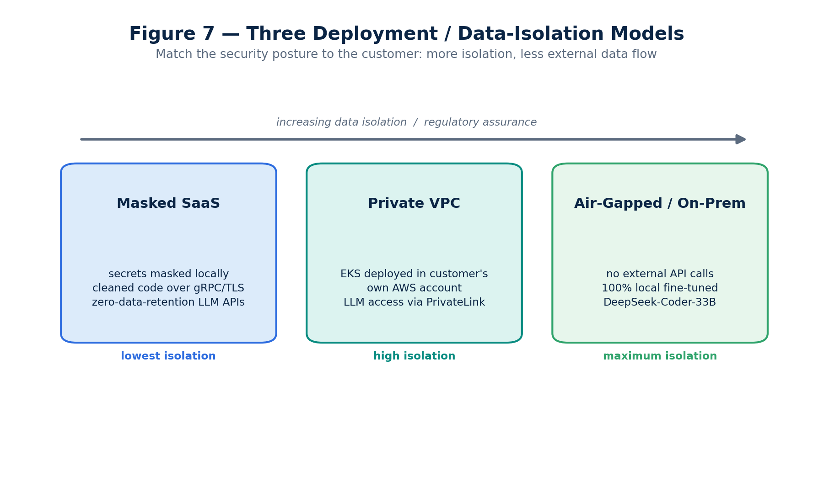
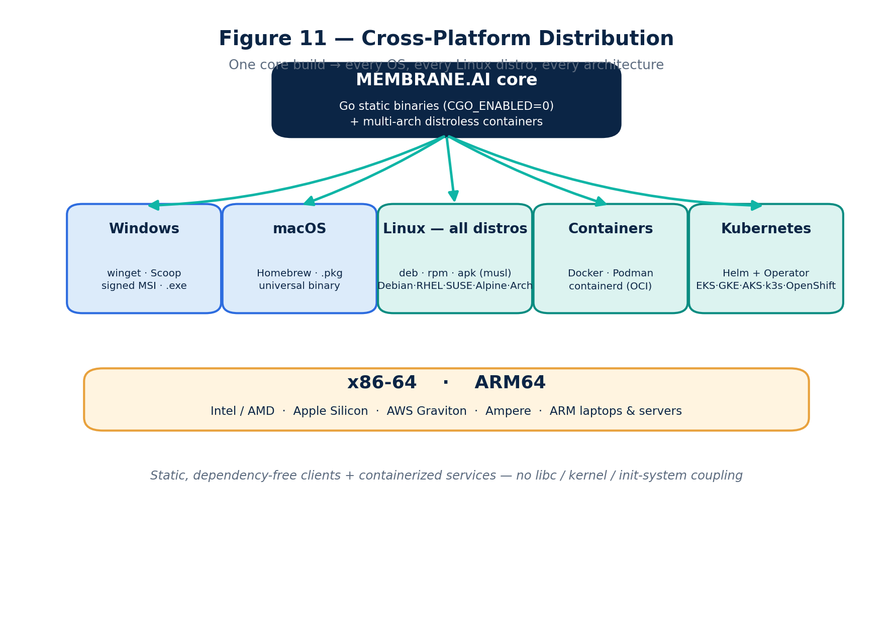

<div align="center">


<br/>


<br/><br/>

### Real-time security and architectural guardrails for AI coding agents.

**Govern AI-generated code at the point of generation — not after the damage is already in the pull request.**

<br/>

<table>
<tr>
<td align="center"><strong>PRE-GENERATION</strong><br/><sub>Prompt & MCP governance</sub></td>
<td align="center"><strong>GENERATION</strong><br/><sub>Gold-codebase context</sub></td>
<td align="center"><strong>VERIFICATION</strong><br/><sub>AST + semantic review</sub></td>
<td align="center"><strong>DELIVERY</strong><br/><sub>IDE + CI/CD enforcement</sub></td>
</tr>
</table>

<p>
<a href="#why-membraneai"><b>Why</b></a> ·
<a href="#what-it-does"><b>Capabilities</b></a> ·
<a href="#architecture"><b>Architecture</b></a> ·
<a href="#deployment-models"><b>Deployment</b></a> ·
<a href="#cross-platform-by-design"><b>Platforms</b></a> ·
<a href="#roadmap"><b>Roadmap</b></a>
</p>

</div>

---

## Why MEMBRANE.AI

AI coding assistants and autonomous agents are moving faster than the governance systems around them.

Traditional AppSec tooling usually sees code **after** it has already been generated, committed, or opened as a pull request. MEMBRANE.AI moves the control point earlier: into the AI request, tool-call boundary, local developer workflow, and CI/CD pipeline.

It is designed as an autonomous **architectural & security immune system** for AI-assisted software development.

<div align="center">



</div>

The platform is aimed at failure modes that classic signature-based scanners do not fully capture:

- semantic security mistakes;
- prompt injection embedded in code or context;
- architectural drift;
- hallucinated or malicious dependencies;
- unsafe MCP/tool usage;
- AI-generated changes that violate an organization's own implementation patterns.

---

## What it does

<table>
<tr>
<td width="50%" valign="top">

### 🛡️ Dual-point governance

A proactive prompt/MCP gateway can inject approved architectural context **before generation**, while deterministic AST and semantic verification inspect resulting changes in the IDE and CI/CD.

</td>
<td width="50%" valign="top">

### 🧬 Gold-codebase RAG

Each organization can build a `pgvector` index from its own trusted implementations so review decisions are grounded in the codebase's actual standards rather than only generic rules.

</td>
</tr>
<tr>
<td width="50%" valign="top">

### 🧠 Cost-managed consensus

A tiered path — cache, context pruning, local model triage, then premium semantic consensus — is designed to reserve expensive reasoning for changes that truly need it.

</td>
<td width="50%" valign="top">

### 🔐 Agentic threat governance

The design includes MCP/tool-call controls, package governance, shadow-AI discovery, dependency checks and security boundaries tailored to AI-assisted development.

</td>
</tr>
<tr>
<td width="50%" valign="top">

### 🧭 Architectural alignment

Generated code is evaluated not only for vulnerabilities but for whether it follows repository patterns, boundaries, dependencies and established engineering conventions.

</td>
<td width="50%" valign="top">

### 🏢 Deployment optionality

The platform is designed for masked SaaS, private VPC and fully air-gapped environments, including regulated and security-sensitive organizations.

</td>
</tr>
</table>

---

## Architecture

<div align="center">



<sub>System topology — developer edge, event-driven control plane, analysis services and enterprise integrations.</sub>

</div>

<br/>

At a high level:



<details>
<summary><strong>View the detailed processing flow</strong></summary>

<br/>

<div align="center">

</div>

</details>

Full architecture documentation: [docs/ARCHITECTURE.md](docs/ARCHITECTURE.md)

---

## Protection lifecycle

<div align="center">



<sub>Governance is designed to span generation, verification, delivery and continuous feedback.</sub>

</div>

The intended control loop is simple:

```text
Learn trusted patterns
        ↓
Inject the right context
        ↓
Observe AI-generated change
        ↓
Run deterministic + semantic checks
        ↓
Allow / remediate / block
        ↓
Feed accepted patterns back into organizational knowledge
```

---

## Tech stack

| Layer | Choice |
| --- | --- |
| Core services & orchestration | **Go (Golang)** |
| Semantic AI interface | **Python 3.12+ · FastAPI** |
| Edge gateway | **Envoy Proxy** |
| Event backbone | **Redpanda / Apache Kafka** |
| Cache | **Redis Enterprise** |
| Relational + vector state | **Amazon Aurora PostgreSQL · pgvector / HNSW** |
| Local inference | **vLLM · EC2 Inf2 / GPU** |
| Infrastructure | **AWS EKS · multi-AZ VPC · Terraform · Helm** |

<div align="center">

```text
Go control plane
      │
      ├── fast local policy / orchestration
      │
      ├── event-driven analysis
      │
      └── Python semantic boundary
               │
               ├── local inference
               ├── vector context
               └── cloud-model consensus when policy allows
```

</div>

---

## Deployment models

<div align="center">



</div>

| Model | Isolation | Data posture | Intended use |
| --- | --- | --- | --- |
| **Masked SaaS** | Standard | Sensitive values masked locally before approved external processing | Fastest operational model |
| **Private VPC** | High | Full platform inside customer-controlled cloud boundary | Enterprise / regulated workloads |
| **Air-gapped / on-prem** | Maximum | No required external model API calls | Defense, high-security and isolated environments |

---

## Cross-platform by design

MEMBRANE.AI is designed to run where developers and pipelines already run.

<div align="center">



</div>

- **Client / agent** components are designed as single Go static binaries with `CGO_ENABLED=0`.
- **Server / semantic** components are distributed as multi-arch OCI containers.
- Target platforms include Windows, macOS, glibc-based Linux, musl-based Linux, x86-64 and ARM64.
- The optional eBPF layer is expected to degrade gracefully where unsupported.

| Component | Windows | macOS | Linux glibc | Linux musl | x86-64 | ARM64 |
| --- | :---: | :---: | :---: | :---: | :---: | :---: |
| CLI / Code Sweeper | ✓ | ✓ | ✓ | ✓ | ✓ | ✓ |
| Local gateway & masking | ✓ | ✓ | ✓ | ✓ | ✓ | ✓ |
| IDE extension | ✓ | ✓ | ✓ | ✓ | ✓ | ✓ |
| Core / semantic services | containers | containers | ✓ | ✓ | ✓ | ✓ |

Planned distribution paths include Winget, Scoop, MSI, Homebrew, macOS packages, `.deb`, `.rpm`, `.apk`, tarballs, multi-arch container registries and Helm-based deployment.

---

## Governance surfaces

<div align="center">

| Before generation | During generation | Before merge | Enterprise runtime |
| :---: | :---: | :---: | :---: |
| Prompt policy | Context grounding | Semantic review | MCP governance |
| Secret masking | Architecture hints | AST checks | Tool-call controls |
| MCP filtering | Gold-code RAG | Dependency policy | Audit / SIEM output |
| Allowed models | Cost routing | PR status | VPC / air-gap modes |

</div>

---

## Documentation

| Document | Purpose |
| --- | --- |
| [Architecture](docs/ARCHITECTURE.md) | System and service architecture |
| [API](API.md) | API surface |
| [Engineering Standards](docs/ENGINEERING-STANDARDS.md) | Repository engineering conventions |
| [Architecture Decisions](docs/DECISIONS.md) | Recorded design decisions |
| [Compliance](docs/COMPLIANCE.md) | Compliance-oriented design notes |
| [SCM Integration](docs/SCM-INTEGRATION.md) | Source-control integration |
| [Skills](docs/SKILLS.md) | Agent / developer skill model |
| [Releasing](docs/RELEASING.md) | Release process |
| [Roadmap](docs/ROADMAP.md) | Planned product evolution |
| [System Report](docs/report/report.md) | Detailed product and system report |

---

## Roadmap

Development is tracked on the GitHub project board:

**https://github.com/users/Ozgurisikdamar/projects/5**

For the detailed technical roadmap, see [docs/ROADMAP.md](docs/ROADMAP.md).

---

## Status

> **Early development.** Architecture and specification are defined; implementation is in progress.

The repository already contains the architectural foundation, service structure, deployment definitions, API documentation, evaluation work and supporting engineering specifications. Functionality will continue to evolve with the roadmap.

---

## License

See [LICENSE](LICENSE).

<br/>

<div align="center">


<sub><strong>MEMBRANE.AI</strong> · Keep AI-generated software inside the boundaries your organization trusts.</sub>

</div>
