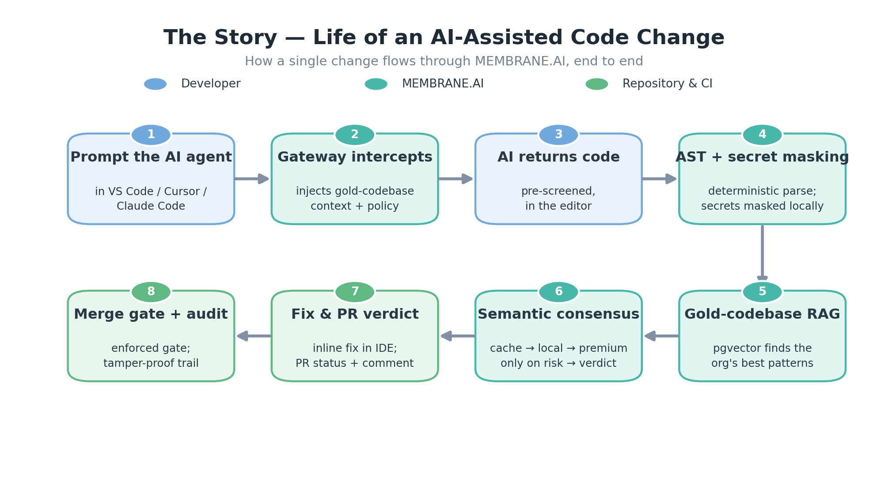
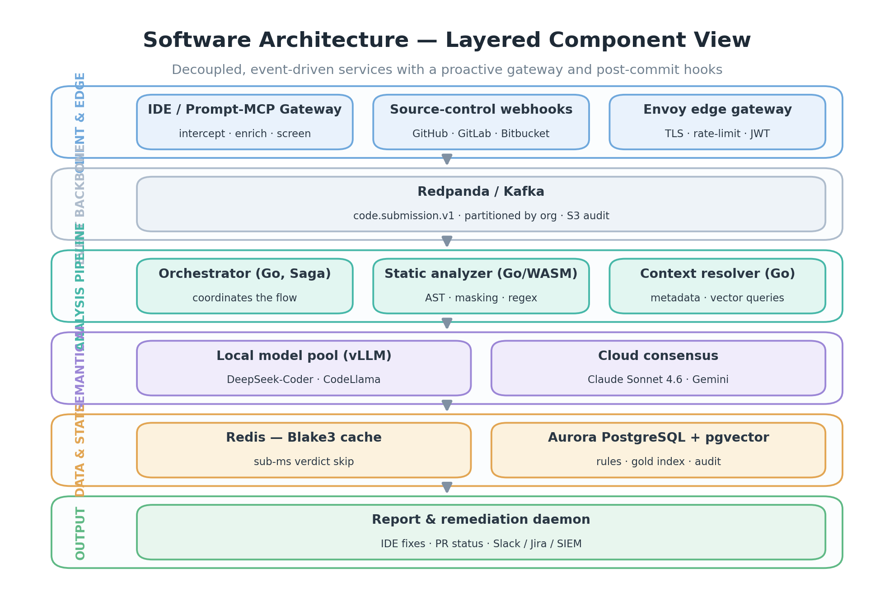
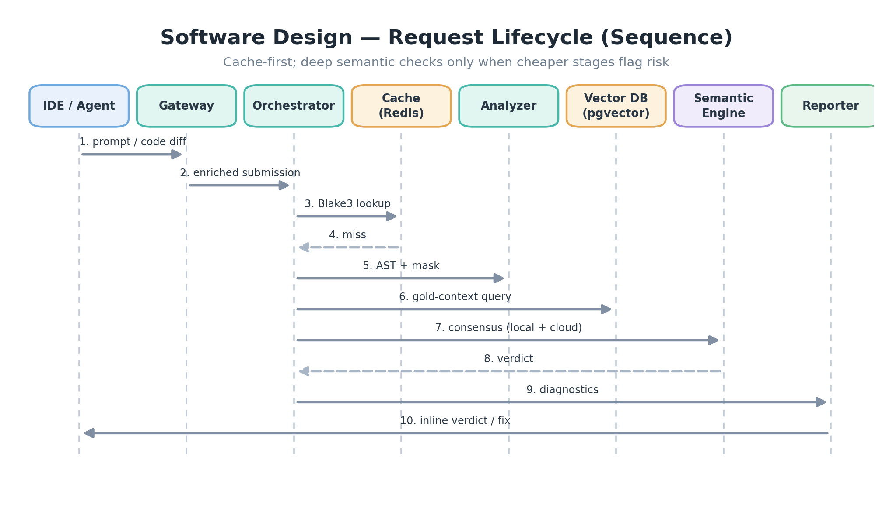
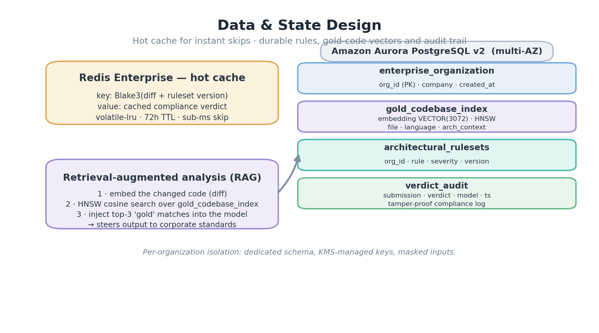
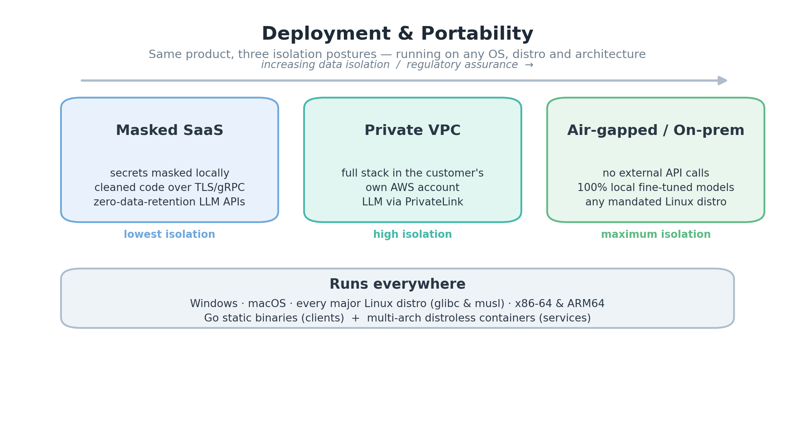

# The Story — Life of an AI-Assisted Code Change

Follow a single change as it travels through MEMBRANE.AI — from the moment a developer prompts an AI agent, through proactive interception and layered analysis, to the enforced merge gate and a tamper-proof audit trail. Governance happens **at the point of generation** and **again before merge**, so insecure or off-pattern code is prevented early and verified again at the gate.

---

# Software Architecture — Layered Component View

A decoupled, event-driven design: a proactive gateway and post-commit hooks feed a durable event backbone; a Go analysis pipeline coordinates deterministic and semantic checks; Redis and Aurora hold hot and durable state; and a remediation daemon returns verdicts to the developer and the pipeline.

---

# Component Responsibilities

| Layer | Components | Responsibility |
| --- | --- | --- |
| Client & Edge | Prompt / MCP Gateway · Source-control webhooks · Envoy | Intercept AI requests at the point of generation and inject gold-codebase context; stream every diff; terminate TLS with rate-limiting and JWT auth |
| Event backbone | Redpanda / Kafka | Durable, per-organization-partitioned event stream with long-term S3 audit |
| Analysis | Orchestrator (Go, Saga) · Static analyzer (Go/WASM) · Context resolver | Drive the cache → AST → vector → semantic → consensus flow within a 1200 ms deadline; deterministic parse + secret masking; gold-codebase vector queries |
| Semantic AI | Local model pool (vLLM) · Cloud consensus | Cheap first-pass triage inside the trust boundary; premium dual-model review only on flagged risk |
| Data & State | Redis · Aurora + pgvector | Blake3 verdict cache for sub-millisecond skips; rulesets, gold-code vectors and tamper-proof audit |
| Output | Report & remediation daemon | Inline IDE fixes, PR status / comments, and Slack / Jira / SIEM dispatch |

---

# Software Design — Request Lifecycle

The runtime is **cache-first**: a Blake3 hash can return a stored verdict in under a millisecond. On a miss, deterministic analysis and gold-codebase retrieval run first, and the premium semantic consensus is invoked only when cheaper stages flag genuine risk.

---

# Data & State Design

Hot state lives in Redis for instant skips; durable state — organizational rulesets, the gold-codebase vector index, and the compliance audit trail — lives in Aurora PostgreSQL with `pgvector`. Retrieval-augmented analysis grounds every model judgment in the organization's own best implementations.

---

# Deployment & Portability

One product, three isolation postures — masked SaaS, private VPC, and fully air-gapped — running on **any operating system, any Linux distribution, and any architecture**. Static Go binaries cover the clients; multi-architecture distroless containers cover the services.

---

# Tech Stack at a Glance

| Concern | Technology |
| --- | --- |
| Core services | Go — single static binaries (`CGO_ENABLED=0`) |
| Semantic interface | Python 3.12+ / FastAPI |
| Edge gateway | Envoy Proxy |
| Event bus | Redpanda / Apache Kafka |
| Cache | Redis Enterprise (Blake3 keys) |
| Database + vectors | Amazon Aurora PostgreSQL + pgvector (HNSW) |
| Local inference | vLLM — DeepSeek-Coder / CodeLlama |
| Cloud models | Claude Sonnet 4.6 · Gemini |
| Orchestration | Kubernetes — EKS and any distribution |
| Infrastructure as code | Terraform + Helm |
| Platforms | Windows · macOS · all Linux (glibc / musl) · x86-64 / ARM64 |
